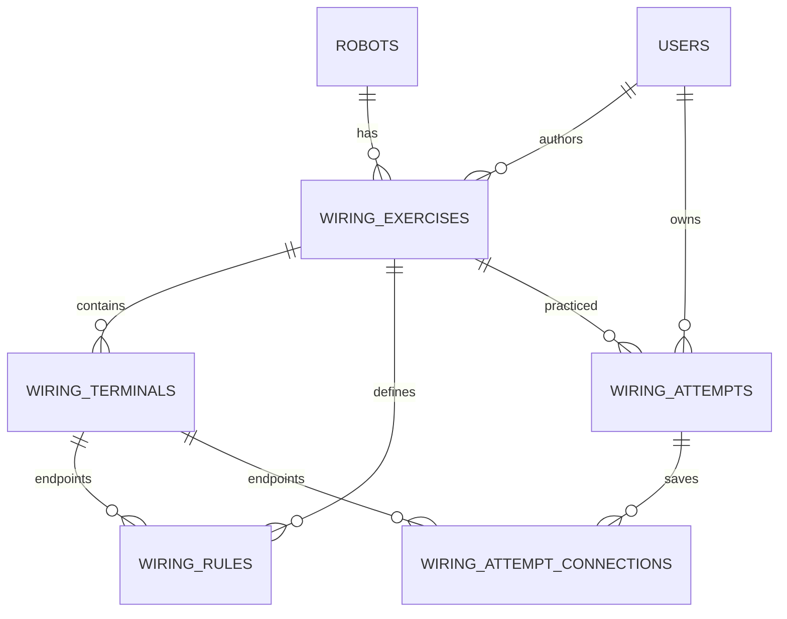

# Đợt 7 — Thiết kế phòng nối dây, chặng 1

Khảo sát 05/10/2026: HEAD c2afc9b đã push theo yêu cầu trực tiếp; baseline
Node 121/121, JUnit 59/59. DB robot_lab_content_test có migration 001–010
và quyền CREATE/REFERENCES. Không sửa sơ đồ robot hoặc rubric nhiệm vụ A/B.

## Phạm vi dữ liệu chính thức

DB robots.wiring và assets/js/data.js khớp hai mẫu line-follower,
obstacle-avoider. Khai báo cặp cụ thể bằng dữ liệu biên soạn, không parse prose.
D5–D10 nối ENA/IN1/IN2/IN3/IN4/ENB; line-left.OUT nối D2,
line-right.OUT nối D3; HC-SR04 TRIG/ECHO nối D11/D12. Dòng 5V gộp được
khai báo riêng VCC từng cảm biến. GND chung khai báo Arduino.GND nối từng
GND cảm biến, L298N.GND và battery.MINUS. Nhiều dây tại chân chung hợp lệ.

Sơ đồ cũ chưa liệt kê đầy đủ đầu ra động cơ, Vs và jumper module: chúng nằm
ngoài phạm vi bài này, không tự thêm hoặc suy luận. Mỗi bài công bố rõ phạm vi.
Chỉ chấm cặp trực tiếp, không chấm mọi sơ đồ điện tương đương hay vận hành thật.

Căn cứ vai trò chân, không dùng để suy đoán jumper của module:
[Arduino UNO R3 pinout](https://content.arduino.cc/assets/A000066-full-pinout.pdf),
[ST L298 datasheet](https://www.st.com/resource/en/datasheet/l298.pdf).

## ERD trước migration 011

- exercises: BIGINT id, UNIQUE code, robot_id/created_by FK RESTRICT; nội dung,
  trạng thái, timestamps. Công bố bất biến; nhân bản có code mới.
- terminals: BIGINT id, exercise_id FK; UNIQUE(exercise_id,id),
  UNIQUE(exercise_id,code); nhãn, thứ tự, x/y CHECK trong viewBox 1000×1000.
- rules: FK ghép (exercise_id,terminal_a/b) tới terminals; CHECK a<b,
  UNIQUE(exercise_id,a,b) ngăn trùng REQUIRED/FORBIDDEN.
- attempts: FK exercise/user RESTRICT; UNIQUE(id,exercise_id); version >=1,
  DRAFT/SUBMITTED, C/W/M/N và DECIMAL(4,1) nullable trước khi nộp;
  CHECK kết quả đầy đủ khi SUBMITTED; index(user_id,id).
- connections: FK ghép (attempt_id,exercise_id) và hai đầu nối cùng exercise;
  CHECK a<b, UNIQUE(attempt_id,a,b), toàn bộ FK RESTRICT.

Bài/lượt đọc theo số truy vấn cố định; catalog/lịch sử chỉ lấy metadata,
không vòng lặp tải con N+1. Chấm trong WiringGrade; lưu cuối, grade và state
cùng transaction. Khóa bài rồi lượt để nhất quán công bố/lưu trữ/tạo lượt;
mọi mutation kiểm owner/state/version. Submit lặp trả kết quả cũ có thông báo.

## Kế hoạch kiểm chứng

JUnit hành vi trước bean; Node guard trước route/view. Live Tomcat riêng8081,
MySQL thật, hai USER và ADMIN; SQL đối chiếu điểm, stale version, submit đôi,
archive/continue. Chrome click/drag/keyboard/no-JS/mobile và hồi quy trang cũ.
Review độc lập trước commit chặng 1 và trước khi mở chặng hỗ trợ.
# Chặng 2 — bản chụp hỗ trợ và lịch sử

Migration 012 thêm hai bảng, không sửa migration 011 đã chạy:

- `wiring_support_requests`: PK id, FK attempt_id → wiring_attempts và user_id → users,
  trạng thái OPEN/ANSWERED/CLOSED, version, timestamps; index (user_id,id), (state,id).
  Cột sinh `active_attempt_id` chỉ có giá trị khi OPEN/ANSWERED, UNIQUE bảo đảm tối đa
  một yêu cầu hoạt động/lượt ngay cả khi hai request đồng thời.
- `wiring_support_messages`: PK id, FK request_id → request và author_id → users;
  nội dung/tác giả/thời gian bất biến. Bản chụp tùy chọn gồm văn bản do server dựng,
  các cặp ID chuẩn hóa, version/trạng thái/điểm/thời điểm của lượt đã lưu.
  FK ghép (request_id,exercise_id) giữ đúng bài; FK ghép đầu nối được nhắc tới thuộc bài.
  Mọi FK RESTRICT; không cập nhật/xóa tin nhắn đã lưu.

Bản chụp dùng MEDIUMTEXT có cấu trúc đọc được và chuỗi cặp ID do server tạo, không nhận JSON
từ client và không cần thư viện mới. Văn bản giữ cả nhãn đầu nối tại lúc gửi; SVG đọc
tọa độ từ bài đã công bố bất biến, dây lấy từ bản chụp từng tin, không từ lượt hiện tại.
Transaction khóa bài → lượt nguồn → yêu cầu; bản chụp được đọc trên cùng kết nối sau khóa.
Form gửi expectedVersion; trả lời/đóng từ phiên bản cũ bị từ chối 422.
