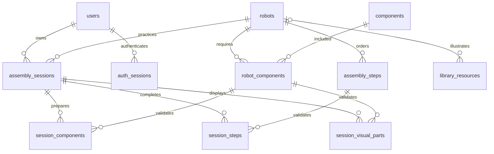

# ERD và data dictionary

DDL đầy đủ, kiểu/cỡ field và constraint là `database/schema.sql`. Đây là nguồn chuẩn cho schema; hợp đồng JSON và giới hạn validation ở `API.md`.

| Bảng | Khóa và dữ liệu |
|---|---|
| users | id BIGINT UNSIGNED tự tăng; email VARCHAR(254) UNIQUE; display_name VARCHAR(150); password_hash VARCHAR(255); role ENUM user/admin mặc định user; created_at TIMESTAMP. Không seed user. Tài quản lý băm mật khẩu. |
| robots | id VARCHAR(64) slug; name, level ENUM, summary TEXT, image, build_time, main_sensor, skills TEXT; wiring JSON chứa danh sách chân/đích/ghi chú. |
| components | id slug; name, category, image, description TEXT, specs JSON thông số theo tên. |
| robot_components | PK(robot_id,component_id); 2 FK; quantity INT 1–10000. |
| assembly_steps | id slug; robot_id FK; step_order INT 1–10000, UNIQUE(robot_id,step_order); title, instruction TEXT, illustration JSON. UNIQUE(robot_id,id) phục vụ FK tiến độ. |
| auth_sessions | id BIGINT UNSIGNED tự tăng; user_id FK CASCADE; token_hash CHAR(64) ASCII binary UNIQUE; expires_at DATETIME(3) có index; revoked_at nullable; created_at TIMESTAMP(3). Không lưu token gốc. |
| assembly_sessions | id BIGINT UNSIGNED tự tăng; user_id FK; robot_id FK; status ENUM PREPARING/READY/IN_PROGRESS/COMPLETED/ABANDONED, mặc định PREPARING; created_at/updated_at; UNIQUE(id,robot_id). Index (user_id,status,created_at), (user_id,robot_id,created_at). Cho phép nhiều phiên lịch sử; adapter khóa user khi createOrResume để tránh tạo hai phiên đang dở đồng thời. |
| session_components | PK(session_id,component_id); robot_id; prepared BOOLEAN mặc định false với CHECK 0/1; updated_at TIMESTAMP(3). FK kép bảo đảm linh kiện thuộc đúng robot của phiên. |
| session_steps | PK(session_id,step_id); robot_id; completed BOOLEAN mặc định false CHECK 0/1; simulation_state JSON nullable; updated_at TIMESTAMP(3). FK kép bảo đảm bước thuộc đúng robot của phiên. |
| session_visual_parts | PK(session_id,component_id); robot_id; FK kép xác nhận phiên và linh kiện đúng robot. Có hàng nghĩa là bộ phận đang hiện trên mô hình 3D. |
| library_resources | id slug; robot_id FK nullable (tài nguyên chung); title, type ENUM image/document/link, url, description TEXT. |
| schema_migrations | version VARCHAR(100) PK; applied_at TIMESTAMP. Bảng kỹ thuật, ngoài 11 bảng nghiệp vụ sau migration 003. |

Mặc định NOT NULL, trừ library_resources.robot_id, session_steps.simulation_state và auth_sessions.revoked_at. Mọi bảng nghiệp vụ InnoDB, utf8mb4_0900_ai_ci; slug ASCII binary để so sánh chính xác. Khóa ngoại có index do MySQL tạo; unique và primary key có index riêng. Cấu hình MySQL session/server UTC và mysql2 `timezone: 'Z'` để Date nhất quán.

Xóa phiên lắp ráp cascade xuống tiến độ; xóa user cascade xuống auth_sessions nhưng bị RESTRICT nếu còn phiên lắp ráp. Mọi FK nội dung RESTRICT. Không cho xóa bước/quan hệ đã có tiến độ. FK kép ngăn chèn tiến độ của robot khác vào một phiên. Adapter kiểm tra chủ sở hữu khi đọc/ghi tiến độ; service của Tài chịu trách nhiệm xác thực, quy tắc chuyển trạng thái và tính phần trăm. Schema không tự tính trạng thái tổng hợp.

`schema.sql` là chuỗi migration 001 + 002 + 003 để cài mới. DB đã có 002 chỉ áp dụng 003, không chạy lại schema/seed. Migration 003 thêm trạng thái mô hình 3D mà không xóa tiến độ cũ. Migration 002 bảo toàn tiến độ và đổi trạng thái cũ in_progress/completed thành IN_PROGRESS/COMPLETED. Tài liệu/ảnh trong `homework/` là minh chứng phiên bản 001, không phải schema tích hợp mới (12 bảng tính cả schema_migrations).

Thay đổi hướng dẫn đang dùng có thể làm nội dung thực hành thay đổi; phiên bản đầu chưa lưu snapshot nội dung. Nhóm cần thống nhất có khóa chỉnh sửa nội dung đang dùng hay triển khai versioning nếu yêu cầu này phát sinh.
