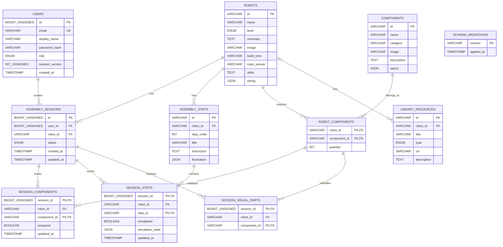

# ERD - Robot Lab

Khóa ngoại kép: `(session_id, robot_id)` tham chiếu `assembly_sessions(id, robot_id)`;
`session_components(robot_id, component_id)` tham chiếu `robot_components`;
`session_steps(robot_id, step_id)` tham chiếu `assembly_steps(robot_id, id)`;
`session_visual_parts(robot_id, component_id)` tham chiếu `robot_components`.
`robot_components` dùng khóa chính ghép `(robot_id, component_id)` để biểu diễn
quan hệ nhiều-nhiều và lưu số lượng cần thiết. `assembly_steps` duy nhất thứ tự
bước trong từng robot. `library_resources.robot_id` được phép NULL để lưu tài
liệu dùng chung. Các khóa BIGINT là UNSIGNED.

`HttpSession`/cookie `JSESSIONID` là trạng thái runtime do Tomcat quản lý, không
phải bảng database. Bảng `users` lưu tài khoản, password hash và role; tiến độ
được lưu theo từng phiên lắp ráp trong `assembly_sessions` cùng các bảng con.
`schema_migrations` ghi phiên bản cấu trúc đã áp dụng. Đối chiếu chi tiết từng
cột và constraint tại `database/schema.sql` và các file trong
`database/migrations/`; các lớp `XxxDB` là nơi chạy SQL tương ứng.
