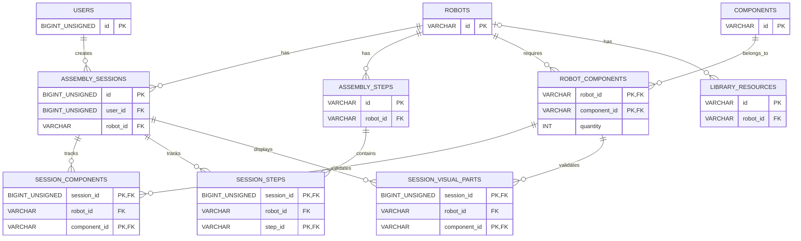

# ERD - Robot Lab

Khóa ngoại kép: `(session_id, robot_id)` tham chiếu `assembly_sessions(id, robot_id)`;
`session_components(robot_id, component_id)` tham chiếu `robot_components`;
`session_steps(robot_id, step_id)` tham chiếu `assembly_steps(robot_id, id)`;
`session_visual_parts(robot_id, component_id)` tham chiếu `robot_components`.
Các khóa BIGINT là UNSIGNED. Xác thực runtime dùng `HttpSession` do Tomcat quản
lý; bảng `users` chỉ lưu tài khoản, mật khẩu đã băm và role. Xem
`database/schema.sql` và `docs/ARCHITECTURE.md` để đối chiếu SQL với DAO.
