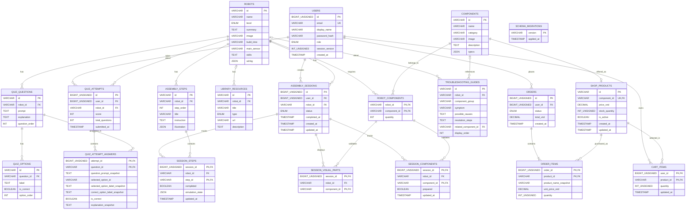

# ERD - Robot Lab

```mermaid
erDiagram

    USERS {
        BIGINT_UNSIGNED id PK
        VARCHAR email UK
        VARCHAR display_name
        VARCHAR password_hash
        ENUM role
        INT_UNSIGNED session_version
        TIMESTAMP created_at
    }

    ROBOTS {
        VARCHAR id PK
        VARCHAR name
        ENUM level
        TEXT summary
        VARCHAR image
        VARCHAR build_time
        VARCHAR main_sensor
        TEXT skills
        JSON wiring
    }

    COMPONENTS {
        VARCHAR id PK
        VARCHAR name
        VARCHAR category
        VARCHAR image
        TEXT description
        JSON specs
    }

    ROBOT_COMPONENTS {
        VARCHAR robot_id PK, FK
        VARCHAR component_id PK, FK
        INT quantity
    }

    ASSEMBLY_STEPS {
        VARCHAR id PK
        VARCHAR robot_id FK
        INT step_order
        VARCHAR title
        TEXT instruction
        JSON illustration
    }

    ASSEMBLY_SESSIONS {
        BIGINT_UNSIGNED id PK
        BIGINT_UNSIGNED user_id FK
        VARCHAR robot_id FK
        ENUM status
        TIMESTAMP completed_at
        TIMESTAMP created_at
        TIMESTAMP updated_at
    }

    SESSION_COMPONENTS {
        BIGINT_UNSIGNED session_id PK, FK
        VARCHAR robot_id FK
        VARCHAR component_id PK, FK
        BOOLEAN prepared
        TIMESTAMP updated_at
    }

    SESSION_STEPS {
        BIGINT_UNSIGNED session_id PK, FK
        VARCHAR robot_id FK
        VARCHAR step_id PK, FK
        BOOLEAN completed
        JSON simulation_state
        TIMESTAMP updated_at
    }

    SESSION_VISUAL_PARTS {
        BIGINT_UNSIGNED session_id PK, FK
        VARCHAR robot_id FK
        VARCHAR component_id PK, FK
    }

    LIBRARY_RESOURCES {
        VARCHAR id PK
        VARCHAR robot_id FK
        VARCHAR title
        ENUM type
        VARCHAR url
        TEXT description
    }

    QUIZ_QUESTIONS {
        VARCHAR id PK
        VARCHAR robot_id FK
        TEXT prompt
        TEXT explanation
        INT question_order
    }

    QUIZ_OPTIONS {
        VARCHAR id PK
        VARCHAR question_id FK
        TEXT label
        BOOLEAN is_correct
        INT option_order
    }

    QUIZ_ATTEMPTS {
        BIGINT_UNSIGNED id PK
        BIGINT_UNSIGNED user_id FK
        VARCHAR robot_id FK
        INT score
        INT total_questions
        TIMESTAMP submitted_at
    }

    QUIZ_ATTEMPT_ANSWERS {
        BIGINT_UNSIGNED attempt_id PK, FK
        VARCHAR question_id PK, FK
        TEXT question_prompt_snapshot
        VARCHAR selected_option_id
        TEXT selected_option_label_snapshot
        TEXT correct_option_label_snapshot
        BOOLEAN is_correct
        TEXT explanation_snapshot
    }

    TROUBLESHOOTING_GUIDES {
        VARCHAR id PK
        VARCHAR robot_id FK
        VARCHAR component_group
        VARCHAR symptom
        TEXT possible_causes
        TEXT resolution_steps
        VARCHAR related_component_id FK
        INT display_order
    }

    SHOP_PRODUCTS {
        VARCHAR id PK
        VARCHAR component_id UK, FK
        DECIMAL price_vnd
        INT_UNSIGNED stock_quantity
        BOOLEAN is_active
        TIMESTAMP created_at
        TIMESTAMP updated_at
    }

    CART_ITEMS {
        BIGINT_UNSIGNED user_id PK, FK
        VARCHAR product_id PK, FK
        INT_UNSIGNED quantity
        TIMESTAMP updated_at
    }

    ORDERS {
        BIGINT_UNSIGNED id PK
        BIGINT_UNSIGNED user_id FK
        ENUM status
        DECIMAL total_vnd
        TIMESTAMP created_at
    }

    ORDER_ITEMS {
        BIGINT_UNSIGNED order_id PK, FK
        VARCHAR product_id PK, FK
        VARCHAR product_name_snapshot
        DECIMAL unit_price_vnd
        INT_UNSIGNED quantity
    }

    SCHEMA_MIGRATIONS {
        VARCHAR version PK
        TIMESTAMP applied_at
    }

    USERS ||--o{ ASSEMBLY_SESSIONS : creates

    ROBOTS ||--o{ ASSEMBLY_SESSIONS : has

    ROBOTS ||--o{ ASSEMBLY_STEPS : has

    ROBOTS ||--o{ ROBOT_COMPONENTS : requires

    COMPONENTS ||--o{ ROBOT_COMPONENTS : belongs_to

    ASSEMBLY_SESSIONS ||--o{ SESSION_COMPONENTS : tracks

    ROBOT_COMPONENTS ||--o{ SESSION_COMPONENTS : validates

    ASSEMBLY_SESSIONS ||--o{ SESSION_STEPS : tracks

    ASSEMBLY_STEPS ||--o{ SESSION_STEPS : contains

    ASSEMBLY_SESSIONS ||--o{ SESSION_VISUAL_PARTS : displays

    ROBOT_COMPONENTS ||--o{ SESSION_VISUAL_PARTS : validates

    ROBOTS o|--o{ LIBRARY_RESOURCES : has

    ROBOTS ||--o{ QUIZ_QUESTIONS : has

    QUIZ_QUESTIONS ||--o{ QUIZ_OPTIONS : has

    USERS ||--o{ QUIZ_ATTEMPTS : takes

    ROBOTS ||--o{ QUIZ_ATTEMPTS : about

    QUIZ_ATTEMPTS ||--o{ QUIZ_ATTEMPT_ANSWERS : contains

    QUIZ_QUESTIONS ||--o{ QUIZ_ATTEMPT_ANSWERS : answered_in

    ROBOTS o|--o{ TROUBLESHOOTING_GUIDES : about

    COMPONENTS o|--o{ TROUBLESHOOTING_GUIDES : references

    COMPONENTS ||--o| SHOP_PRODUCTS : offered_as

    USERS ||--o{ CART_ITEMS : owns

    SHOP_PRODUCTS ||--o{ CART_ITEMS : selected_in

    USERS ||--o{ ORDERS : places

    ORDERS ||--|{ ORDER_ITEMS : contains

    SHOP_PRODUCTS ||--o{ ORDER_ITEMS : purchased_as
```

Khóa ngoại kép: `(session_id, robot_id)` tham chiếu `assembly_sessions(id, robot_id)`;
`session_components(robot_id, component_id)` tham chiếu `robot_components`;
`session_steps(robot_id, step_id)` tham chiếu `assembly_steps(robot_id, id)`;
`session_visual_parts(robot_id, component_id)` tham chiếu `robot_components`.
`robot_components` dùng khóa chính ghép `(robot_id, component_id)` để biểu diễn
quan hệ nhiều-nhiều và lưu số lượng cần thiết. `assembly_steps` duy nhất thứ tự
bước trong từng robot. `library_resources.robot_id` được phép NULL để lưu tài
liệu dùng chung. Các khóa BIGINT là UNSIGNED.

`HttpSession`/cookie `JSESSIONID` là trạng thái runtime do Tomcat quản lý, không
phải bảng database. Bảng `users` lưu tài khoản, password hash và role; tiến độ
được lưu theo từng phiên lắp ráp trong `assembly_sessions` cùng các bảng con.
`schema_migrations` ghi phiên bản cấu trúc đã áp dụng. Đối chiếu chi tiết từng
cột và constraint tại `database/schema.sql` và các file trong
`database/migrations/`; các lớp `XxxDB` là nơi chạy SQL tương ứng.

`assembly_sessions.completed_at` (thêm ở migration `005_assembly_completion`)
là NULL cho tới khi phiên chuyển sang `COMPLETED`. Giá trị này chỉ được
`AssemblySessionDB.completeSession()` ghi, sau khi xác nhận (trong cùng một
câu UPDATE, dựa trên dữ liệu thật lúc ghi) rằng mọi `component_id` bắt buộc
của robot trong `robot_components` đều có mặt trong `session_visual_parts`
của phiên — so theo tập hợp mã linh kiện, không so số lượng. Nhờ điều kiện
nằm ngay trong `WHERE` của UPDATE, hai request gần đồng thời (double-click,
retry) không thể ghi đè `completed_at` hoặc tạo hai lần hoàn tất.

Bốn bảng `quiz_*` (thêm ở migration `006_quiz`) phục vụ bài kiểm tra kiến thức
theo robot. `quiz_questions`/`quiz_options` là nội dung do admin quản lý;
`quiz_options.is_correct` không bao giờ được API công khai gửi ra trước khi
nộp bài. Mỗi lượt nộp tạo đúng một dòng `quiz_attempts` (không có trạng thái
"đang làm dở" lưu ở server — bài được chấm ngay khi nộp). `quiz_attempt_answers`
lưu **bản chụp** (`question_prompt_snapshot`, `selected_option_label_snapshot`,
`correct_option_label_snapshot`, `explanation_snapshot`) tại đúng thời điểm nộp
bài; các trang xem lại lịch sử đọc từ bản chụp này, không JOIN ngược lại
`quiz_questions`/`quiz_options`, nên admin sửa câu hỏi/đáp án sau đó không làm
đổi kết quả cũ. `question_id` trên `quiz_attempt_answers` vẫn giữ khóa ngoại
`ON DELETE RESTRICT` để admin không xóa được câu hỏi đã có người làm — chỉ có
thể sửa nội dung.

`troubleshooting_guides` (thêm ở migration `007_troubleshooting`) là nội dung
"hướng dẫn kiểm tra" do admin quản lý — không phải dữ liệu đọc từ robot thật.
`robot_id` cho phép NULL để một tình huống dùng chung cho nhiều mẫu robot có
cùng nhóm linh kiện (cùng cách dùng NULL như `library_resources.robot_id`).
`related_component_id` trỏ tới một linh kiện cụ thể để trang tra cứu liên kết
sang danh mục linh kiện; dùng `ON DELETE SET NULL` (không phải RESTRICT) vì
liên kết này chỉ mang tính tham khảo, xóa linh kiện không nên bị chặn bởi một
bài hướng dẫn tra cứu.

## Cửa hàng linh kiện (đợt 4)

`shop_products` tách thông tin bán hàng khỏi `components`: một linh kiện kỹ
thuật có tối đa một mặt hàng (`component_id` UNIQUE), còn giá VND, tồn kho và
trạng thái kinh doanh nằm riêng. Không xóa cứng sản phẩm qua giao diện admin;
DELETE chỉ đặt `is_active = false`. FK tới `components` và từ lịch sử đặt hàng
dùng `ON DELETE RESTRICT` để không mất dữ liệu tham chiếu.

`cart_items` dùng PK ghép `(user_id, product_id)`, nên mỗi user có tối đa một
dòng cho một sản phẩm; `user_id` được lấy từ `HttpSession`, tuyệt đối không lấy
từ request body. `orders.user_id` cũng xác định chủ sở hữu. Mọi lần đọc/sửa giỏ
và lịch sử đều lọc theo user đang đăng nhập.

`order_items` giữ `product_name_snapshot` và `unit_price_vnd` tại thời điểm
checkout. Lịch sử hiển thị từ các giá trị snapshot cùng số lượng, không tính
ngược bằng giá hiện tại. `orders.total_vnd` do server tính từ snapshot trong
transaction. Giá là số nguyên VND (DECIMAL scale 0); đây là đơn mô phỏng, không
có cổng thanh toán hay dữ liệu thẻ.

Quy tắc xóa: `cart_items.user_id` dùng `ON DELETE CASCADE` để dọn giỏ khi user
bị xóa; `orders.user_id`, `order_items.order_id`, `order_items.product_id`,
`cart_items.product_id` và `shop_products.component_id` đều `ON DELETE RESTRICT`
để giữ lịch sử và tham chiếu kỹ thuật. Admin DELETE sản phẩm là cập nhật cờ
`is_active = false`; giao diện không thực hiện xóa vật lý.

Checkout khóa các dòng `cart_items` thuộc user rồi khóa các sản phẩm theo ID
ổn định bằng `SELECT ... FOR UPDATE`. Trong cùng transaction, server kiểm tra
sản phẩm còn active và đủ kho, đọc giá hiện tại từ DB, giảm kho, tạo `orders`
cùng `order_items`, xóa các dòng giỏ đã mua và commit. Thiếu hàng/lỗi SQL sẽ
rollback tất cả; request đồng thời không thể bán vượt kho hoặc tạo hai đơn từ
cùng giỏ đã bị tiêu thụ. Trạng thái `CONFIRMED` chỉ biểu thị đơn được ghi nhận
trong bản demo; `CANCELLED` là trạng thái lưu trữ nếu sau này có luồng hủy hợp lệ.

Các giá trong `database/seed-shop.sql` là số tròn phục vụ giao diện/demo, không
phải báo giá. Tham khảo một số listing linh kiện tại ThegioiIC ngày 28-09-2026:
[Arduino Uno R3](https://www.thegioiic.com/arduino-uno-r3-atmega328),
[HC-SR04](https://www.thegioiic.com/hc-sr04-cam-bien-sieu-am?dl=1),
[L298N](https://www.thegioiic.com/l298n-mach-cau-h-2a-do). Listing thay đổi theo
thời điểm, phiên bản và tồn kho; giá demo không đồng nghĩa giá bán thực.

Đợt mở rộng danh mục thêm hai dữ liệu mẫu (`line-obstacle`, `servo-scout`) bằng
các seed `database/seed-robots-phase3.sql`, `seed-quiz-phase3.sql` và
`seed-troubleshooting-phase3.sql`. Đây là dữ liệu bổ sung vào các bảng hiện có
(`robots`, `robot_components`, `assembly_steps`, `quiz_questions`,
`quiz_options`, `troubleshooting_guides`), không thay đổi ERD hay cần migration.
